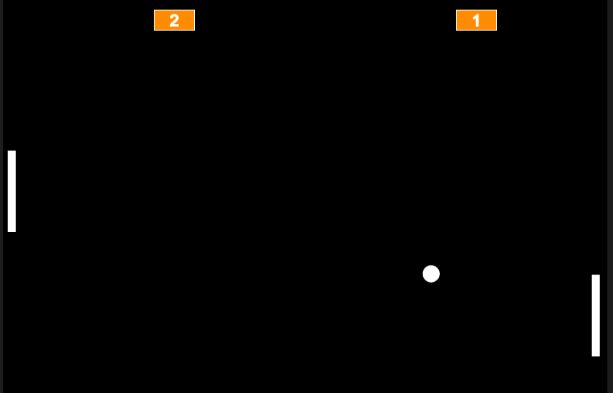

# Jogo Pong 
## Primeiro projeto em JavaScript criado durante o curso da Alura

Desenvolvido no P5 JS Web
```
Abrir com p5 js web
```
Status: Finalizado

## Descrição do projeto:

Desenvolvido na plataforma web do p5 js, durante as aulas de Iniciante em Programção, por isso o mesmo só vai rodar dentro do site do p5.
É um jogo de ping pong você _versus_ máquina. Sua raquete será a do lado esquerdo da tela, para movê-la basta usar as setas de cima e baixo do seu teclado.




**Acesso ao projeto:**

* Abrir o site https://editor.p5js.org/
* Criar todos os arquivos no _Sketch Files_ e copiar os códigos respectivos disponibilizados
* Dar _play_ e se divertir

```
Feito em JavaScript
```

**Autores:**

* https://github.com/jessicafra
* https://github.com/guilhermeonrails
